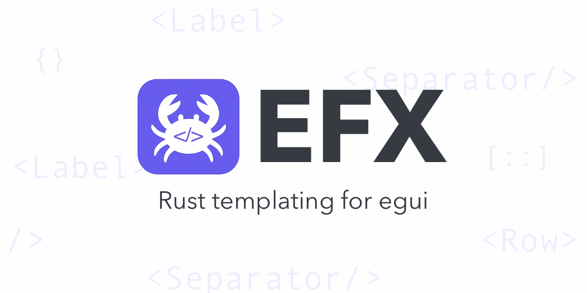

# EFx
[](https://crates.io/crates/efx)


[](#)
[](https://docs.rs/efx)
[](https://github.com/ZhukMax/efx/blob/main/LICENSE)


**EFx** — Rust 🦀 XML Template Engine for  [egui](https://github.com/emilk/egui)-based frameworks: [eframe](https://github.com/emilk/egui/tree/master/crates/eframe), [bevy_egui](https://github.com/vladbat00/bevy_egui), [egui-winit](https://crates.io/crates/egui-winit), [egui-miniquad](https://github.com/not-fl3/egui-miniquad).
`efx!` is a proc-macro for writing tiny XML-like UI snippets in `eframe/egui`. It converts short tags into `egui` calls.

You can embed arbitrary Rust expressions inside braces (`{...}`).

---

### Install & import

Requires `egui` (the project currently uses `egui 0.32`). Add to `Cargo.toml`:
```toml
[dependencies]
efx = "0.6"
egui = "0.32" # or egui-based framework
```

Inside this repo just import the macro:
```rust
use efx::efx; // the macro
```

---

### Documentation
You can see on web page https://docs.rs/efx/latest/efx/ or in files:

- [Introduction](efx/docs/intro.md) ([🇫🇷 fr](efx/docs/fr/intro.md))
- [Tags](efx/docs/tags.md)
- [Guide](efx/docs/guide.md)

---

### Expression interpolation `{...}`

Inside tag content you can insert any Rust expression that implements `Display`:

```rust
let a = 2;
let b = 3;
efx!(ui, r#"<Label>Sum: {a + b}</Label>"#);
```

#### Escaping braces

To print `{` or `}`, use double braces (same as `format!`):

```rust
efx!(ui, r#"<Label>Literals: {{ and }}</Label>"#);
```

---

### Errors & diagnostics

At compile time the macro parses your snippet; at runtime it shows readable diagnostics via `ui.Label(...)` when input is invalid:

* **Unknown tag**
  Output: `Unknown tag: <TagName>`

* **Mismatched open/close tags**
  Output: `Mismatched tags: <open> and </close>`

* **Interpolation count mismatch**
  Happens if the parser found e.g. two `{expr}` parts but after processing the text there’s a different number of `{}` placeholders. Make the counts match.

---

### Current limitations

* **Case-sensitive tag names.**
* Interpolated expressions must implement `Display`.

---

### Roadmap & RFCs

**TL;DR.** EFx is a minimalist XML DSL on top of `egui` that compiles to plain `ui.*` calls.
The next three releases focus on expressiveness and first-class examples across popular `egui` runtimes:

* **0.5 — Attributes & core tags:** type-checked attributes, `Heading`, `Hyperlink`, `TextField`, plus `Window/CentralPanel/SidePanel`. Diagnostics & examples.
* **0.6 — Components & events:** reusable components/slots, event sugar (`onClick`, etc.), classes/presets, Bevy examples.
* **0.7 — Themes & layouts:** lightweight style sheets, extended containers (`Tabs/Table` behind `extras`), perf & polish.

This plan is incremental and **non-breaking**; new features are opt-in. Priorities may change based on community feedback.

👉 **Full RFC:** [EFX-0001 — Roadmap 0.5–0.7](efx/docs/rfcs/EFX-0001-roadmap-0.5-0.7.md)

👉 **RFC index:** [RFC/README.md](efx/docs/rfcs/README.md)

---

### Supported `egui` runtimes

EFx renders into any runtime that provides `&mut egui::Ui`. We officially build examples for the following targets:

**Tier-1**

* `eframe` (native + wasm)
* `bevy_egui` (native)
* raw `winit+wgpu` (via `egui-winit` + `egui-wgpu`). [Wgpu](https://github.com/gfx-rs/wgpu) - a cross-platform, safe, pure-rust graphics API. It runs natively on Vulkan, Metal, D3D12, and OpenGL; and on top of WebGL2 and WebGPU on wasm. Follows WebGPU specification. With async/await API.

**Tier-2 (compatible today; examples later / community support)**

* `egui-miniquad` (for `macroquad/miniquad` overlays) - Relatively minimalistic API well suited for small to medium graphics projects. Supports multiple backends, including browser target.
* `egui_sdl2_*` backends
* `egui_glow` / `tao` (lower-level backends)

### Quickstart (pick one)

**A) eframe**

```toml
# Cargo.toml
[dependencies]
efx    = "0.6"
eframe = "0.32"
```

```rust
use eframe::egui;
use efx::efx;

egui::CentralPanel::default().show(ctx, |ui| {
    efx!(ui, r#"<Column><Label>Hello, EFx</Label><Separator/></Column>"#);
});
```

**B) Bevy + bevy\_egui**

```toml
# Cargo.toml
[dependencies]
efx       = "0.6"
bevy      = "0.16"
bevy_egui = "0.36"  # re-exports `egui`
```

```rust
use bevy_egui::{EguiPlugin, EguiContexts};
use efx::efx;

bevy_egui::egui::Window::new("EFx").show(egui_ctx.ctx_mut(), |ui| {
    efx!(ui, r#"<Row><Label>It works</Label></Row>"#);
});
```

> Tip: import `egui` via `use bevy_egui::egui as egui;` to avoid version mismatches.

**C) Raw winit + wgpu**

```toml
# Cargo.toml
[dependencies]
efx        = "0.6"
egui       = "0.32"
egui-winit = "0.32"
egui-wgpu  = "0.32"
winit      = "0.30"
wgpu       = "26.0"
```

Use the example in `examples/winit_wgpu_min.rs` as a starting point.

---

### Contributing

[]()

* Start with the roadmap RFC: [EFX-0001](efx/docs/rfcs/EFX-0001-roadmap-0.5-0.7.md).
* You can write me with your ideas on [mail@zhukmax.com](mailto:mail@zhukmax.com).
* Open issues are grouped by milestones **0.6 / 0.7 / 0.8**.
* PRs that change behavior should reference the relevant RFC section.
* Looking for help with: Bevy example(s), raw `winit+wgpu` example, attribute codegen & compile-fail tests, docs.

---

### Changelog
See in file [Changelog.md](efx/Changelog.md)

### Licence
The MIT License. Please see [License File](efx/LICENSE) for more information.
